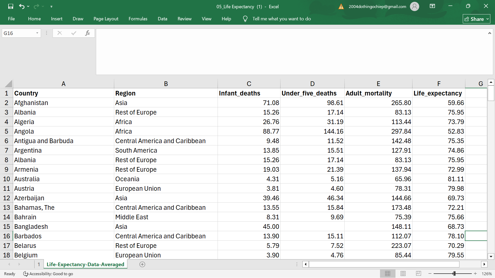
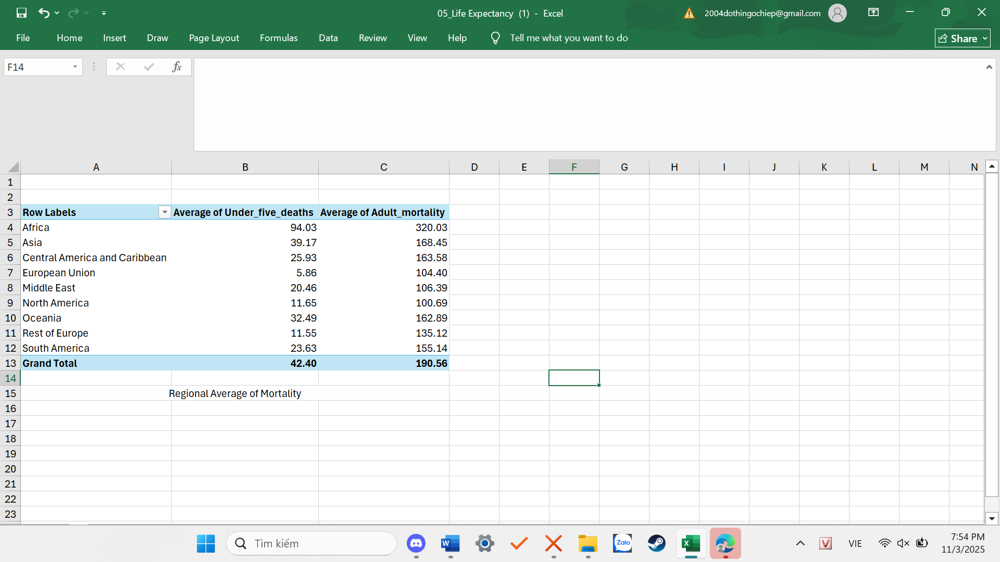
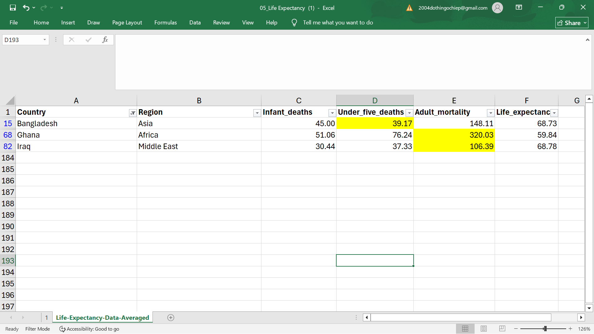
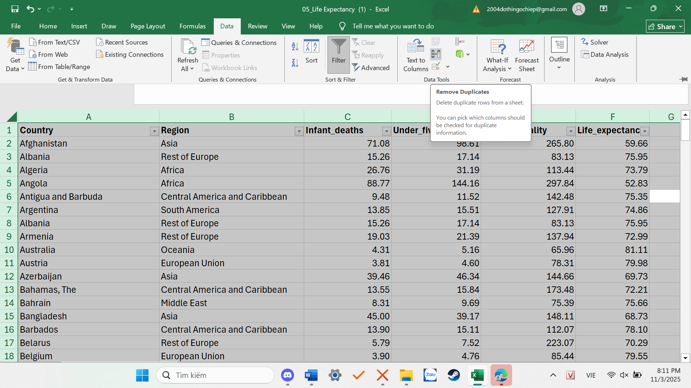
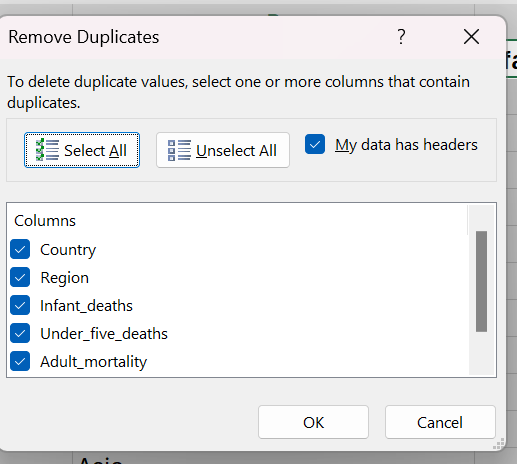
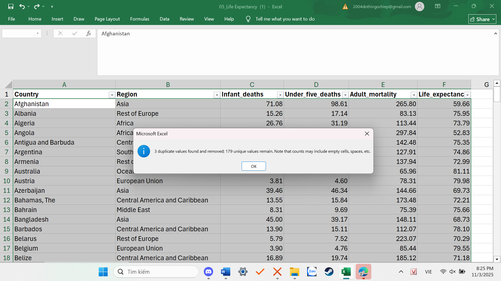
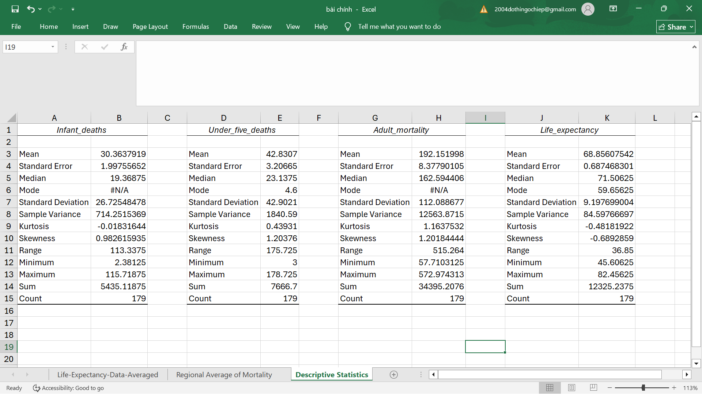
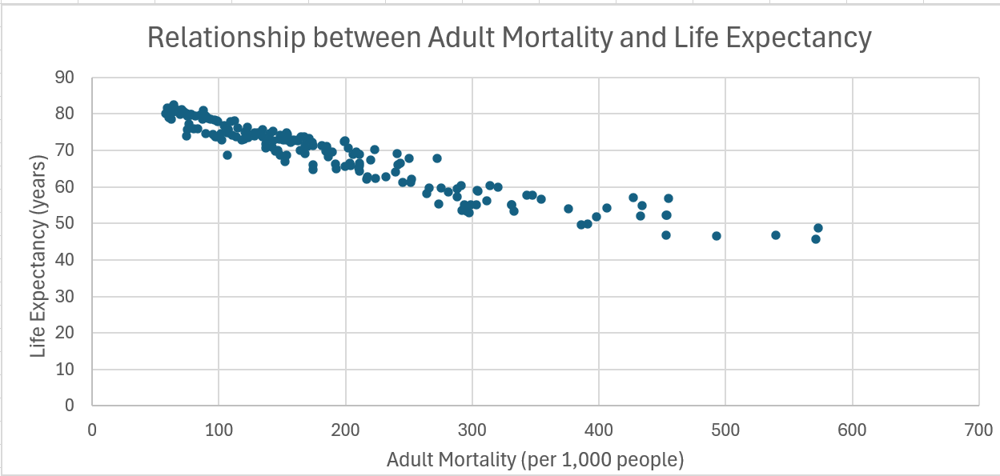
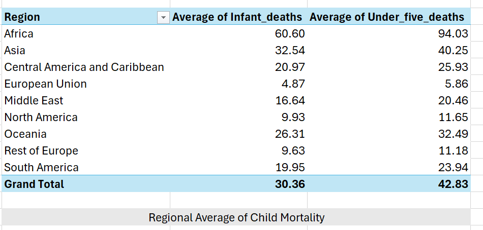
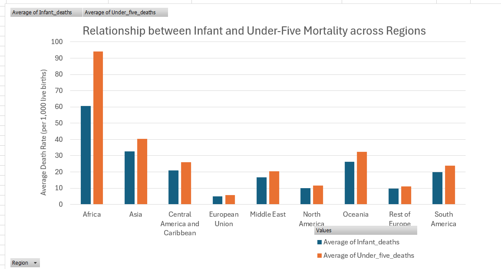

# MIS 311 – Individual Assignment  
**Student Name:** Do Thi Ngoc Hiep  
**Student ID:** 2232300127  
**Topic:** Life Expectancy – Data Analysis and Insights  

---

## Data Overview

The dataset titled “Life Expectancy” presents comprehensive information on key health and demographic indicators across 182 countries. It focuses on mortality and survival statistics, making it a valuable resource for examining the relationship between early-age mortality and average life expectancy, and for comparing overall health outcomes across world regions.

It contains 182 rows and 6 columns, each representing specific variables that together illustrate global health patterns:

- Country: The name of each country represented in the dataset (e.g., Japan, France, Nigeria, Brazil).
- Region: The broader geographical area to which each country belongs (e.g., Asia, Europe, Africa).
- Infant_deaths: The number of infant deaths per 1,000 live births, indicating the quality of maternal and neonatal care.
- Under_five_deaths: The number of deaths of children under age five per 1,000 live births, reflecting child healthcare and nutrition.
- Adult_mortality: The adult mortality rate per 1,000 population, showing the impact of diseases, healthcare access, and living conditions.
- Life_expectancy: The average number of years a newborn is expected to live, representing the overall health, environment, and economic situation of a country.

Although the original source of the dataset is not explicitly mentioned, it is likely derived or compiled from official international databases such as the World Health Organization (WHO), World Bank, or the United Nations Development Programme (UNDP). These organizations regularly publish country-level mortality and life-expectancy data that align closely with the variables presented here.

From an analytical perspective, this dataset is useful for exploring:

- The correlation between mortality indicators (infant, under-five, and adult) and average life expectancy, which helps identify how improvements in healthcare systems and economic development impact longevity.
- Regional disparities in health outcomes, illustrating global inequality in access to healthcare, sanitation, and living conditions.
- Patterns that may guide policy analysis, allowing comparisons between developed and developing regions and highlighting where public-health investment is most needed.

---

## Data Cleaning

### Handle missing values

During the cleaning process, I found three missing values in the dataset: one in Under_five_deaths and two in Adult_mortality. These missing values appeared in Bangladesh, Ghana, and Iraq. Missing data can affect the accuracy of averages and comparisons, so it needed to be handled carefully before analysis.

To fix this, I created a Pivot Table in Excel named “Regional Average of Mortality”. I selected the dataset and inserted a Pivot Table. Then, I placed Region in the Rows field and both Under_five_deaths and Adult_mortality in the Values field. I changed the calculation type from Sum to Average, so the table showed the average mortality rate for each region. This made it easy to see typical values by region and use them to fill in the blanks.

Next, I referred to the Pivot Table to replace the missing data. Each blank cell was filled with the average value of the same region — for example, using the Asia average for Bangladesh, the Africa average for Ghana, and the Middle East average for Iraq. This method was chosen because countries in the same region often have similar living conditions and healthcare systems. Using regional averages helps keep the data realistic and balanced without changing the overall pattern.

### Remove Duplicates

After handling the missing data, I checked for duplicate records to ensure that each country appeared only once. I used the Remove Duplicates function in Excel by selecting all columns and confirming whether any repeated rows existed.

**Data → Data Tools → Remove duplicate.**

I opened the Remove Duplicates dialog box in Excel, ticked the option “My data has headers,” and clicked “Select All” so that every column would be compared.

Then, I pressed OK, and Excel displayed a message showing that three duplicate rows were found and removed. This step helped keep the dataset clean and prevented repeated data from affecting the analysis results.

Finally, I used the COUNTBLANK function to confirm that there were no remaining empty cells. After completing these steps, the dataset became complete and consistent.

---

## Descriptive Statistics

After completing the cleaning process, I performed descriptive statistical analysis to explore the overall health trends and differences among countries. The analysis focused on four key variables: Infant_deaths, Under_five_deaths, Adult_mortality, and Life_expectancy. The descriptive statistics were calculated using Excel’s Data Analysis ToolPak, which produced a detailed summary of the dataset’s averages, variations, and ranges.

The results show that there is considerable variation in mortality and life expectancy across countries. The mean Adult_mortality (192.15) is much higher than the averages of Infant_deaths (30.36) and Under_five_deaths (42.83), suggesting that adult health problems and chronic diseases contribute significantly to overall mortality differences. Meanwhile, the average Life_expectancy (68.86 years) indicates that most countries fall within the 65–75 year range, but the range of 36.85 years highlights striking inequalities between regions with advanced healthcare and those with limited medical access.

---

## Insight 1: Relationship Between Adult Mortality and Life Expectancy

*Figure 1: Scatter plot showing a negative relationship between adult mortality and life expectancy.*

The scatter plot shows a clear negative relationship between adult mortality and life expectancy. Countries with higher adult mortality rates tend to have much lower life expectancy. This pattern means that when the number of adult deaths increases, the average lifespan of the population decreases.

The result reflects real-world differences in healthcare quality and living standards. In countries with strong healthcare systems and better access to medical services, adult mortality is lower and people live longer. On the other hand, in regions where healthcare is limited, adult mortality is higher and life expectancy drops significantly.

This finding highlights that improving healthcare for adults—such as disease prevention, medical accessibility, and healthy living conditions—plays a crucial role in increasing life expectancy worldwide.

---

## Insight 2

A Pivot Table and column chart were created to examine the relationship between Infant_deaths and Under_five_deaths across different regions.

*Figure 2: Column Chart – Relationship Between Infant and Under-Five Deaths Across Regions.*

The chart shows a clear positive relationship between the two variables, meaning that regions with higher infant mortality rates also have higher under-five mortality rates.

Africa records the highest average in both categories, followed by South America and some parts of Asia, where limited access to healthcare and sanitation remains a serious problem. In contrast, Europe and North America show very low death rates, reflecting better healthcare quality, maternal care, and nutrition.

This relationship suggests that child mortality is closely tied to regional healthcare development. Regions with stronger medical infrastructure, vaccination programs, and social support systems are able to reduce both infant and under-five deaths more effectively.
